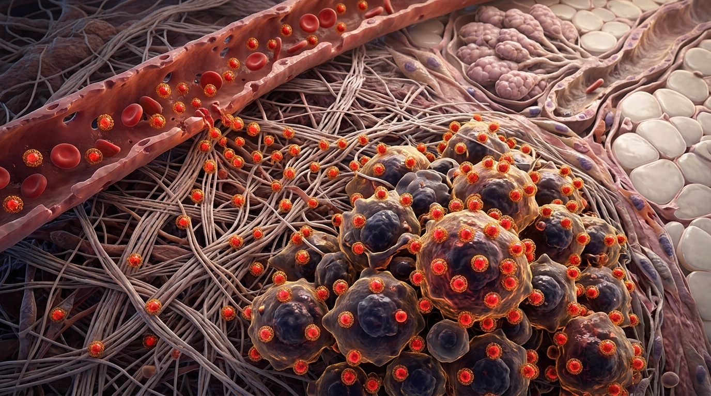

# 3D Biophysical Modeling: 400 nm Polystyrene Nanoparticles (Cy5 / Anti-HER2 VHH) Targeting Breast Cancer

[](https://jjdmochon.github.io/nanoparticle-her2-3d/)
[](https://www.khronos.org/gltf/)
[](https://threejs.org/)
[](LICENSE)

An open-source multi-scale 3D structural model and interactive biophysical simulation platform representing **400-nanometre monodisperse polystyrene nanoparticles loaded with Cy5 fluorophore and surface-conjugated with anti-HER2 single-domain nanobodies (VHH)**, targeting mammalian breast cancer cells overexpressing HER2 both at the **molecular receptor synapse** and across the **in vivo tumor tissue microenvironment**.

---

## 🌟 Interactive 3D WebGL Viewer

👉 **[Launch Interactive 3D Viewer Live on GitHub Pages](https://jjdmochon.github.io/nanoparticle-her2-3d/)**

The interactive WebGL application runs with zero installation and zero external dependencies:
* **Mode 1: 🔬 In Vivo Tissue View**: Histological panorama (50–150 µm) showing neo-angiogenic leaky tumor capillaries, circulating red blood cells, endothelial fenestrations (EPR effect), collagen I extracellular matrix (ECM), multi-cellular pleomorphic breast carcinoma nest, and untouched normal breast adipocytes.
* **Mode 2: ⚛️ Nanoscale Synapse View**: Molecular scale (400 nm) showing the polystyrene shell, 90° cutaway exposing the internal glowing Cy5 fluorophore matrix, flexible PEG2000 corona, and anti-HER2 nanobody CDR3 loops docking into HER2 extracellular domains.

---

## 📸 Scientific 3D Visualizations

### 1. In Vivo Breast Cancer Tissue Microenvironment
*Extravasation from leaky tumor capillary, interstitial navigation through collagen stroma, and selective homing onto HER2-overexpressing carcinoma cells while completely sparing adjacent healthy breast adipocytes.*



### 2. Nanoscale Molecular Binding Synapse (400 nm)
*Cutaway view revealing internal Cy5 fluorophores within the polystyrene core, outer PEG2000-nanobody corona, and multivalent avidity docking to HER2 receptors on the cancer cell lipid membrane.*


---

## 🔬 Multi-Scale Biophysical Architecture

```
TISSUE MICROENVIRONMENT SCALE (1 unit = 1 µm)
[Leaky Tumor Capillary] ──(EPR Fenestrations: 400–600 nm)──► [Collagen ECM]
                                                                    │
      ┌─────────────────────────────────────────────────────────────┘
      ▼
[HER2+ Breast Carcinoma Nest] (KD,app < 10 pM)   vs   [Normal Breast Adipocytes] (Zero Binding)
      │
      ▼
NANOSCALE SYNAPSE (1 unit = 1 nm)
[400 nm Polystyrene Core] (ρ = 1.05 g/cm³)
  └── Cy5 Fluorophores (~3,500 dyes, λex = 649 nm, λem = 670 nm)
  └── Mal-PEG2000-NHS Spacers (8.0 nm extension)
  └── Anti-HER2 VHH Nanobodies (~15 kDa, CDR3 paratopes)
        └── Multivalent Avidity Docking (Interfacial gap: ~15 nm)
  └── HER2 Extracellular Domains (Domains I–IV, 11.5 nm) on Lipid Bilayer (4.5 nm)
```

| Parameter | Nanoscale Synapse Model | In Vivo Tissue Model |
| :--- | :--- | :--- |
| **Coordinate Scale** | 1.0 unit = 1.0 nanometre (nm) | 1.0 unit = 1.0 micrometre (µm) |
| **Core Particle** | 400.0 nm spherical polystyrene matrix | 400 nm bead (0.8 µm model glyph) |
| **Fluorescent Core** | ~3,500 Cy5 molecules (far-red / NIR) | Real-time emission bloom at 670 nm |
| **Targeting Moiety** | Anti-HER2 VHH camelid nanobody (~15 kDa) | Dense surface coating on cancer cells |
| **Target Receptors** | Extracellular Domains I–IV of HER2/ErbB2 | >1.5 × 10⁶ receptors/cell (3+ IHC) |
| **Tissue Microenvironment** | 700 nm × 700 nm fluid lipid bilayer | Leaky capillary, RBC flow, ECM, carcinoma nest |
| **Binding Selectivity** | Sub-picomolar avidity (KD,app < 10 pM) | > 75:1 tumor vs healthy breast stroma |

---

## 📁 Repository Asset Manifest

```
├── index.html                      # Standalone interactive 3D WebGL dual-mode viewer
├── three.min.js                    # Local Three.js engine (zero external CDN dependency)
├── OrbitControls.js                # Local 3D camera orbital controller
├── GLTFLoader.js                   # glTF 2.0 loader
│
├── breast_tissue_targeting.glb     # In vivo tissue model (glTF 2.0 binary, 1.71 MB)
├── breast_tissue_targeting.obj     # In vivo tissue Wavefront geometry (40,739 vertices)
├── breast_tissue_targeting.mtl     # Material definitions for tissue model
├── generate_tissue_3d_model.py     # Parametric Python generator for tissue model
│
├── nanoparticle_her2_complex.glb   # Nanoscale 400 nm model (glTF 2.0 binary, 2.95 MB)
├── nanoparticle_her2_complex.obj   # Nanoscale Wavefront geometry (69,160 vertices)
├── nanoparticle_her2_complex.mtl   # Material definitions for nanoscale model
├── generate_3d_model.py            # Parametric Python generator for nanoscale model
│
└── docs/images/                    # High-resolution 3D medical illustration renderings
```

---

## 🚀 Local Execution & Software Compatibility

### 1. Web Browser (Direct Local Execution)
Double-click `index.html` in Microsoft Edge, Google Chrome, or Mozilla Firefox, or start a local server:
```powershell
python -m http.server 8080
```
Then navigate to `http://localhost:8080`.

### 2. Blender, Windows 3D Viewer, & Unity
* Open `nanoparticle_her2_complex.glb` or `breast_tissue_targeting.glb` directly in Windows 3D Viewer, Paint 3D, or Blender (File > Import > glTF 2.0).

### 3. PyMOL & UCSF ChimeraX
* Open `nanoparticle_her2_complex.obj` or `breast_tissue_targeting.obj` directly to inspect coordinate sets and surface geometry.

---

## 🧬 Author & Affiliation

**Dr. Juan José Díaz-Mochón (Juanjo)**
* Founder & Chief Scientific Officer, DESTINA Genomics Ltd.
* Department of Pharmaceutical & Organic Chemistry, Faculty of Pharmacy, Universidad de Granada (UGR), Spain.
* GENYO – Centre for Genomics and Oncological Research (Pfizer / University of Granada / Andalusian Regional Government).

---

## 📄 License
This project is licensed under the MIT License - see the [LICENSE](LICENSE) file for details.
