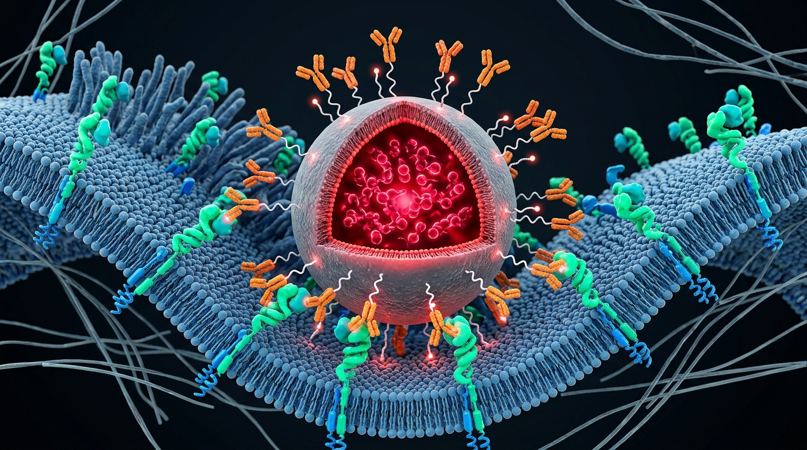

# 3D Biophysical Modeling: 400 nm Polystyrene Nanoparticles (Cy5 / Anti-HER2 VHH) Targeting Breast Cancer

[](https://jjdmochon.github.io/nanoparticle-her2-3d/)
[](https://www.khronos.org/gltf/)
[](https://threejs.org/)
[](https://jjdmochon.github.io/nanoparticle-her2-3d/)
[](LICENSE)

An open-source high-resolution 3D structural model and interactive biophysical simulation platform representing **400-nanometre monodisperse polystyrene nanoparticles loaded with Cy5 fluorophore and surface-conjugated with anti-HER2 single-domain nanobodies (VHH)**, actively binding to a mammalian breast cancer cell membrane overexpressing HER2.

---

## 🌟 Interactive 3D WebGL Viewer

👉 **[Launch Interactive 3D Viewer Live on GitHub Pages](https://jjdmochon.github.io/nanoparticle-her2-3d/)**

The interactive WebGL viewer runs with zero external CDN dependencies:
* **🌓 Light Mode & Dark Mode**: One-click toggle between a clean scientific journal Light Theme (soft slate background with high-contrast molecular silhouettes) and a dark cinematic theme with glowing far-red Cy5 luminescence.
* **🔬 90° Cutaway Inspection**: Dynamic cross-section slider allowing smooth transitions between the closed 400 nm polystyrene nanosphere and an exposed interior revealing the entrapped Cy5 fluorophore matrix.
* **🎯 Camera Presets**:
  1. *Overview*: Full 3D perspective of the 400 nm nanoparticle docked to the cancer cell membrane.
  2. *Cy5 Core Cutaway*: Close-up cross-section inside the hydrophobic polymer core.
  3. *VHH–HER2 Binding Synapse*: High-magnification focus on nanobody CDR3 loops docking into HER2 extracellular domains.
  4. *Membrane Landscape*: Top-down perspective of the undulating lipid bilayer and overexpressed receptor density.
* **⚡ Live Optical Animation**: Real-time simulation of laser excitation (649 nm) and far-red emission bloom (670 nm), avidity contact pulses, and orbital controls.

---

## 📸 Scientific 3D Visualization

*Cutaway view revealing the internal Cy5 fluorophore payload within the 400 nm polystyrene core, surface PEG2000 corona, anti-HER2 nanobodies, and multivalent avidity docking to HER2 receptors on the cancer cell lipid membrane.*



---

## 🔬 Molecular & Biophysical Specifications

```
                              ┌──────────────────────────────────────┐
                              │   400 nm POLYSTYRENE CORE (R=200)    │
                              │   (Internal Cy5 Payload, r < 185 nm) │
                              └──────────────────┬───────────────────┘
                                                 │
                                                 ▼
                              ┌──────────────────────────────────────┐
                              │       Mal-PEG2000-NHS LINKERS        │
                              │      (Contour length ~8.0 nm)        │
                              └──────────────────┬───────────────────┘
                                                 │
                                                 ▼
                              ┌──────────────────────────────────────┐
                              │       ANTI-HER2 VHH NANOBODIES       │
                              │      (~15 kDa, CDR3 loops outward)   │
                              └──────────────────┬───────────────────┘
                                                 │
                        Active Multivalent Avidity Synapse (KD,app < 10 pM)
                                                 │
                                                 ▼
                              ┌──────────────────────────────────────┐
                              │     HER2 EXTRACELLULAR DOMAINS       │
                              │     (Domains I-IV, height 11.5 nm)   │
                              └──────────────────┬───────────────────┘
                                                 │
                                                 ▼
═══════════════════════════════════════════════════════════════════════════════════════════════
                    FLUID LIPID BILAYER (Cancer Cell Membrane, thickness 4.5 nm)
```

| Component | Physical Dimension | 3D Model Units (1 unit = 1 nm) | Stoichiometry / Biophysical Role |
| :--- | :--- | :--- | :--- |
| **Polystyrene Core** | Diameter: 400.0 nm (Radius: 200.0 nm) | R = 200.0, Volume: 3.35 × 10⁷ nm³ | Monodisperse crosslinked styrene matrix (ρ = 1.05 g/cm³) |
| **Cy5 Fluorophores** | Molecular footprint: 1.5 nm × 0.8 nm | 380 explicit 3D dyes + inner glow cloud | ~3,500 dye molecules entrapped via swelling (λem = 670 nm) |
| **PEG2000 Spacers** | Extended length: 7.5–8.5 nm | Cylinder radius: 0.6 nm, length: 8.0 nm | ~140 surface chains (Fibonacci lattice distribution) |
| **Anti-HER2 Nanobody**| 2.5 nm × 3.2 nm × 4.8 nm (prolate) | Triaxial ellipsoid: a = 1.6, b = 2.3, c = 1.6 nm| Camelid VHH domain (~15 kDa, CDR3 paratope) |
| **Lipid Bilayer** | Hydrophobic core + heads: 4.5 nm | 700 nm × 700 nm undulating fluid sheet | Cancer cell plasma membrane patch |
| **HER2 Receptors** | Height: 11.5 nm, Width: 4.2 nm | 4 distinct subdomains (I, II, III, IV) | > 1.5 × 10⁶ receptors / cell (SK-BR-3 phenotype) |
| **Synaptic Synapse** | Interfacial gap: 14.5–16.0 nm | Active binding contact vectors (Y = 10–13 nm) | Multivalent avidity cooperativity (KD,app < 10 pM) |

---

## 📁 Repository Asset Manifest

```
├── index.html                      # Standalone interactive 3D WebGL viewer (Light/Dark Mode)
├── three.min.js                    # Local Three.js engine (zero external CDN dependency)
├── OrbitControls.js                # Local 3D camera orbital controller
├── GLTFLoader.js                   # glTF 2.0 loader
│
├── nanoparticle_her2_complex.glb   # Binary glTF 2.0 3D model (2.95 MB, 12 PBR mesh nodes)
├── nanoparticle_her2_complex.obj   # Wavefront geometry (69,160 vertices, 106,720 faces)
├── nanoparticle_her2_complex.mtl   # Material and optical channel definitions
├── generate_3d_model.py            # Reproducible parametric Python 3D generator
│
├── docs/images/                    # High-resolution 3D medical illustration
│   └── nanoparticle_her2_synapse.jpg
├── README.md                       # Complete biophysical dossier and documentation
└── LICENSE                         # MIT License
```

---

## 🚀 Local Execution & Software Compatibility

### 1. Web Browser (Direct Local Execution)
Double-click `index.html` in Microsoft Edge, Google Chrome, or Mozilla Firefox, or start a local server:
```powershell
python -m http.server 8080
```
Then navigate to `http://localhost:8080`.

### 2. Blender, Windows 3D Viewer, & Unity
* Open `nanoparticle_her2_complex.glb` directly in Windows 3D Viewer, Paint 3D, or Blender (File > Import > glTF 2.0).

### 3. PyMOL & UCSF ChimeraX
* Open `nanoparticle_her2_complex.obj` directly to inspect coordinate sets and surface geometry.

---

## 🧬 Author & Affiliation

**Dr. Juan José Díaz-Mochón (Juanjo)**
* Founder & Chief Scientific Officer, DESTINA Genomics Ltd.
* Department of Pharmaceutical & Organic Chemistry, Faculty of Pharmacy, Universidad de Granada (UGR), Spain.
* GENYO – Centre for Genomics and Oncological Research (Pfizer / University of Granada / Andalusian Regional Government).

---

## 📄 License
This project is licensed under the MIT License - see the [LICENSE](LICENSE) file for details.
